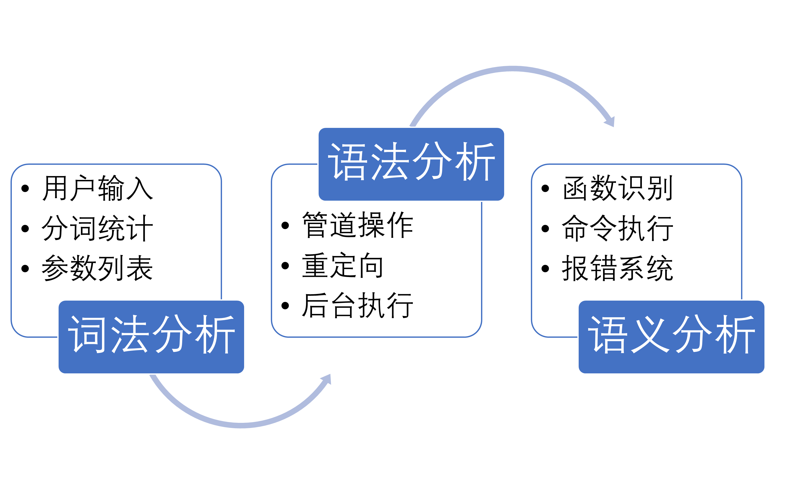

# My Shell

## 引言

命令行解释器作为操作系统中最基本的用户接口，是用户与操作系统底层直接打交道的必经之处。本实验要求通过程序设计语言实现shell 程序的基本功能，设计一个My Shell命令行解释器。

## 编译器前端构建

为了对用户潜在的各类输入进行解析并抽象出合理的语法结构供解释器执行shell命令，我们需要在解释器执行命令前先将用户的输入进行词法分析和语法分析，最后才能交由解释器进行语义分析和执行。

### 词法分析

本shell的编译器前端的词法分析器是使用flex进行搭建的。将二十六个英文字符大小写、十个阿拉伯数字以及一些常常会与字符连用的特殊字符作为一个字进行读取，对于在shell中具有特殊含义的管道符（|），重定向符（<, >, >>）等再单独处理，对单行注释符合（#）之后的内容直接予以忽略等，由此写出的lex前端可以较好的实现对用户输入文本的分词和解析，按照规定的语法将输入划分成不同的词组供后续进一步的语法分析。

通过flex编译我们所编写的lex语法可以自动解析出C语言的词法分析器的众多实用函数以及头文件。我们在定义好规则之后直接在需要的地方调用词法分析器即可实现词法分析功能。

此外，对于用户可能输入的一些非法的无法解析的字符（比如中文字符，非法的不可见字符等），词法分析器会在此步骤直接产生较为精确的报错信息以供用户审阅，报错信息较为友善。

与直接在输入中根据空格划分词组相比，实用lex文法编写的词法分析器具有以下优势：

* 允许**特殊含义字符**与其他词组**连写**而中间不加入空格
* 能够适应用户输入命令的**任意空白符分隔**
* 自适应去除**文本注释**，为后续处理带来方便
* 合理的**报错信息**帮助用户定位词法分析错误

当然，由于flex直接生成的词法分析器将由C语言构建，而本shell的主要实现由C++实现。因此，在撰写Makefile时需要专门为其添加相应的规则，并且在使用时需要使用extern "C"的说明。例如：

~~~cpp
extern "C" 
{
    #include "lexer.h"
    /* 其他引用的C语言头文件 */
}
~~~

### 语法分析

在完成了用户输入语句的词法分析之后，我们获得了按照语义分隔的参数向量列表。虽然可以通过yacc更进一步的对用户的输入内容进行语法分析，但一方面shell的语法相对较为简单，嵌套语法并不多见；另一方面为了能够更好地在语法分析的过程中对进程调度，重定向等进行设置，我们直接采用C++程序对获取的参数列表进行语法分析。

在我所设计的语法分析器中，语法分析一共分为四个环节进行：**管道符分隔**、**重定向定位**、**挂起操作判别**以及**命令识别**。

语法分析的第一个环节是**管道符**分隔。在获取用户输入的命令列表之后，我们首先在命令列表中根据管道符将一串的命令分割为几个子命令，并且将这些子命令按照管道连接的方式分别顺序执行。每个子命令进入下一步解析，同时前一个子命令执行的输出是下一个子命令的输入，第一个子命令由终端输入，最后一个子命令由终端输出，由此可以完成管道操作。

语法分析的第二个环节是**重定向**定位。对于管道分隔后产生的子命令，语法分析器将再次进行扫描，查找其中出现的重定向符号：<, >, >>, 0<, 1>, 2>, 1>>, 2>>。并对这些重定向符号进行一定的语义判别：比如重定向符号之后一定需要跟一个文件名，如果用户在重定向符号之后没有接一个重定向的文件，或者重定向之后的文件并不满足重定向的要求，那么语法分析器会直接在这一步向用户给出错误信息，帮助用户识别潜在的语义输入的错误。如果用户给出的输入一切合法且正常，那么此时语法分析器会将程序所要执行输入和输出的文件描述符进行重定向，并在命令中去除掉这些重定向符号以免影响接下来环节的解析。

语法分析的第三个环节是**后台执行**判别，即挂起操作。如果经过上述解析之后用户输入命令的最后一个字符仍然为&，那么表明用户希望此命令作为后台命令执行。我们通过分裂子进程的方式完成后台执行的要求，并且将用户输入的&符号去除后交由下一环节继续解析。如果未检测到&符号则作为前台命令直接交给下一环节。

语法分析的最后一个环节是**函数命令识别**。我们需要根据用户输入的指令选择合适的函数执行。由于我们的函数种类非常多，如果顺序解析比较的话需要花费较长的时间才能够完成。为了提高命令解析识别的效率，我们采用了**函数数组**和**二分搜索**的方式进行命令识别。

总所周知，在C语言之中所有的函数均是指针，我们可以通过指针的方式调用函数，也可以将函数指针按照正常指针存储一样存储在其他数据结构里。函数数组就是包含了一组函数指针的数组，在定义了函数指针类型之后的使用与其他变量并不太大差异。例如在我们的程序中如下定义了函数指针数组FunctionArray[]：

~~~cpp
/** 定义函数指针类型 */
typedef sh_err_t (Executor::*MemFuncPtr)(const int argc, char * const argv[], char * const env[]) const;
/** 创建函数指针数组 */
MemFuncPtr FunctionArray[FunctionNumber];
~~~

有了函数指针数组之后，我们就可以在数组上进行搜索了。因为用户输入的命令簇为一组字符串，第一个字符串代表了本命令所要执行的函数。而**字符串**是**有序**且可以比较的，因此，我们就在字符串比较的基础上对用户输入的命令进行二分搜索，寻找最合适匹配的命令。如果用户输入的命令在内部命令的函数库中，则直接调用内部命令函数执行，否则就创建一个子进程并调用系统函数执行。

**二分搜索**是一类高效在有序数组上搜索的技巧，其通过每次将搜索空间减半进行查找可以达到$O(logN)$数量级的搜索时间复杂度。由于二分搜索的实现在许多地方具有高度的复用性，因此我们将其写为模板函数实现。相关伪代码如下：

~~~cpp
/**
 * @brief 二分搜索查找
 * 
 * @param lelt 查找左区间，包含
 * @param right 查找右区间，不包含
 * @param val 查找变量
 * @param array 搜索数组
 * @param cmp 比较方法
 * @return int 返回对应元素下标，若没有找到则返回-1
 */
template<typename T>
int Binary_Search(int left, int right, T val, T array[], int cmp(T a, T b))
{
    while (left < right)
        mid = (left + right) / 2;
        int compare_result = cmp(val, array[mid]);
        if val == array[mid]  
            return mid;
        else 
            if val > array[mid]
            	left = mid + 1;
        	else
            	right = mid;
    
    return -1;
}
~~~

通过二分搜索找到合适的函数，并根据数据下标就可以快速定位到正确的函数并执行了。

### 报错系统

由于用户的使用和输入可能具有很大的不确定性，系统中文件的打开状态，一些命令访问执行的结果也可能存在隐患，因此，我们必须对于用户输入命令的执行情况给予尽可能多详细的反馈来提高系统的稳健性，避免shell轻易奔溃。

在实现上，我们在代码中使用了大量的try……catch……代码块处理各种异常，对于所有系统调用的函数返回值都有进行详细的检查。一旦发生意外，我们就会向用户发出提示并告知错误的原因，帮助用户进行正确的输入和排查错误。对于系统调用发生的错误，我们主要通过errno的记录进行识别；对于内部命令的执行情况，我们定义了如下的错误列表，定位用户的各类错误信息与执行情况。

~~~c
enum sh_err_t   //  shell错误类型
{
    SH_SUCCESS = 0, // 正常
    SH_FAILED,      // 失败
    SH_UNDEFINED,   // 未定义
    SH_ARGS,        // 参数错误
    SH_EXIT,        // 退出
};
~~~

当用户发生某一类型内部命令执行的错误时，系统就会根据报错列表的内容进行提示并给予个性化的判别，为用户输入提供更好的体验。

## 内部命令实现

在最新的版本中，shell 程序支持以下内部命令：bg、cd 、clr、dir、echo 、exec 、exit 、fg 、help、jobs 、pwd 、set 、test 、time 、umask。这些命令的实现介绍如下。

### bg

bg命令的格式为：bg <job>

bg命令用于将被挂起的进程<job>转到后台。如果没有<job>参数，则默认将当前进程放到后台运行，相当于在命令后加上&符号。

bg命令处理的主要是由Ctrl+Z控制信号所引起的在后台暂定运行的程序。

### cd

cd命令的格式为：cd <directory>  

该命令可以把当前默认目录改变为<directory>。如果没有<directory>参数，则显示主目录。如该目录不存在，会出现相应的错误信息。

这个命令主要是通过`chdir()`函数来实现的。该函数可以将当前进程的工作目录切换到输入参数对应目录下，如果对应目录存在且能够正常打开，则会返回0，否则会返回相应的异常状态。我们通过该命令可以切换进程的工作目录，并且根据该函数的返回信息判断相应的错误情况给予用户以提示。

同时，这个命令也可以改变PWD环境变量，通过`setenv()`函数设置PWD的环境变量为切换后的工作目录，让环境变量与我们的shell中的工作目录保持逻辑上的一致性。

当然，其中有一项内容需要特殊处理，那就是用户输入中的**“\~”符号**。因为“\~”符号代表了用户的主目录，如果用户输入的目录以“\~”开头的话，我们需要在更改目录前先将用户的输入的“\~”字符转变为用户主目录的路径，然后再进行接下来的操作。

### clr

clr  是一个清屏命令。clr命令等价与普通shell中的clear命令，其作用是将显示屏幕上的内容全部清除干净。

依托丰富的不可见控制字符，Linux的输出控制变得十分简单而有趣了。通过向屏幕或者是输出文件上输出一些不可见的控制字符，我们可以很容易地改变屏幕或是这些输出文件里的输出的位置、输出字符的颜色、当前屏幕或文件的状态等等。而在清屏功能上亦是如此。

看上去将整个屏幕清除似乎不是十分容易，但其实通过向输出文件中打印**"\x1b[H\x1b[2J"**字符之后，所有原来文件中的内容就自动被清楚了，而在屏幕之上表现的效果便是清屏。

### dir

dir命令的命令格式为：dir <directory>  

该命令的功能是列出目录<directory>的内容。如果没有<directory>参数，则显示当前目录内容。在实现上，dir命令与cd命令有许多异曲同工之处，二者都是对目录进行操作。

与cd命令类似，dir命令之中也需要对用户可能查询命令中的“\~”字符进行特殊的替换处理。将“\~”字符替换为用户的主目录后可以保证程序以正确的方式继续运行。

### echo

echo命令的格式为：echo <comment> 

echo命令用于在屏幕上显示<comment>并换行，其中多个空格和制表符被缩减为一个空格。

由于在前期flex解析的时候已经将用户所有的输入根据空白符进行划分进行了解析，因此在实现echo命令时，我们只需要将echo命令之后的参数逐一输出，中间以一个空格分开，在所有内容输出完毕之后再输出一个换行符即可。

### exec

exec命令的命令格式为：exec <command> 

exec命令用于执行命令<command>，并且将该命令对应的代码覆盖当前运行这个命令的进程的代码，以执行新的命令替换 当前的shell进程。

在C语言的库中包含有exec一系列的函数可以帮助我们在C程序中实现执行exec命令。我们可以使用运行指令向量的`execvp()`函数实现调用exec命令。

需要注意的是，在我们使用execvp函数时，此时我们解析语法中的命令第一个命令为exec，因此我们向函数传参时要去掉第一个命令，从第二个参数开始传给execvp。此外，如果用户输入中只有一个exec命令而没有其他参数，那么shell应该不做任何处理，相当于什么命令都没有执行。

### exit

exit命令可以退出当前shell。

在My Shell命令行解释器中，所有执行的命令最后都会带回一个返回状态。其中设置的一个状态就是SH_EXIT状态用于判断是否执行的是退出命令。当用户输入exit命令后，该命令正常执行完会返回SH_EXIT状态，主程序循环的shell检测到上一条命令执行完成时的状态为退出状态后便会自动结束shell，退出程序。

### fg

fg <job> ——将后台运行或挂起的作业<job>切换到前台运行。如果没有<job>参数，则默认将当前进程放到后台运行。

### help

help 命令可以显示用户手册。

在程序所在的doc目录下存放了供用户阅读的用户手册，当用户输入help命令后，程序会读取doc目录下的用户手册并将其显示在屏幕上。使用more 命令可以过滤用户手册的信息。

### jobs

jobs <job> ——显示所有挂起的和后台进程的作业号及状态。如果没有列表，则显示当前进程的状态。

在用户通过&操作符或者Ctrl Z控制信号引起一个子进程被挂起到后台时，我们就在父进程中记录下被挂起的子进程的相关信息，包括其所在的工作号（job id），进程号（process id），执行状态（如Running，Stopped，Done，Terminated），当前执行的命令等。所有的这些信息记录在一棵红黑树之中。当用户调用job命令查找时，shell可以快速打印出所有进程的信息或是查找到某一进程的状态信息。

### pwd

pwd 命令的功能是显示当前目录。

pwd命令的实现非常简单，只要将控制台存储的当前工作目录输出到显示处，让负责处理输出的显示终端根据需要在对应的输出文件上打出当前工作目录的输出即可。

### set

set命令用于列出系统中所有的环境变量。

在C语言程序运行时，系统会自动将输入给C语言程序的参数格式argc，参数列表argv，以及对应的所有环境变量列表env传递传递给C语言程序的main函数。因此，一个标准的main函数可以写成如下的形式：

~~~c
int main(int argc, char argv[], char **env)
{
    /*some main part*/
    return 0;
}
~~~

在这个程序里，我们可以直接通过传入main函数的env变量来获取当前程序所处在系统中的所有环境变量，并通过一个while循环将所有环境变量逐一打印便可列出系统中所有的环境变量了。

当然，有时候随着我们程序的运行，我们可能会在环境中设置新的环境变量。而这时原本通过main函数传入的env变量可能还没有来得及进行更新，我们可以通过引用C库中定义的全局变量environ来更新env变量所指向的环境变量的值，确保能够读取到最新的环境变量。

### test

test命令的命令格式为：test <expression> 

test命令可以检测用户输入的表达式<expression>返回的结果是true还是false。为了使命令测试的结果更加可视化，如果test命令返回的结果是正确的且输出在终端中，那么终端上将显示“true”；如果test命令返回的结果是错误的且输出在终端中，那么终端上将显示“false”。

test命令支持丰富的命令格式，下表中列出了目前shell中所支持的test命令及其格式。

在C语言的系统调用库中，也提供了与文件状态信息查询相关的丰富的库函数。在sys/stat库内，有`fstat()`, `stat()`, `lstat()`函数可以提供文件信息。其中，fstat返回与打开的文件描述符相关的文件的状态信息；stat返回通过文件名查询到的文件的状态信息；lstat返回的也是通过文件名查询到的状态信息，但是当文件是符号链接时，lstat返回的时符号链接本身的信息，而stat返回的是该链接指向的文件的信息。

在test文件测试的判断当中，我们主要使用到的是`lstat()`函数对文件状态进行判断。因为在我们的判断里函数需要同时能够处理符号链接相关的内容。`lstat()`函数能够返回一个`struct stat`的结构体，并将文件所有的相关内容都存储在该结构体之中。通过访问`lstat()`函数返回的文件结构信息，test便可以对文件测试进行判断。

### time

time 命令用于显示当前时间。需要注意的是，这里的time命令并不是指Linux当中用于计时的time命令，而是date命令——显示当前的日期与时间等相关信息。

在C语言gcc编译器提供的glibc等许多库里包含丰富的系统调用函数，其中在time.h的头文件里定义了time_t的时间获取指针，tm的结构体以及相应的函数能够帮助我们快速系统时间。

与此同时，time库里面还包含了`strftime()`的函数能够形式化的打印时间结构体中的各种参数，以任何我们所期望的形式。比如通过%c的控制符就可以打印出符合当前区域设置的首选日期和时间表现形式的日期格式。我们将打印出的信息传给显示器进行显示即可。关于strftime函数的具体格式说明可以参考下面这张图片：

### umask

umask <mask> ——设定新创建文件或目录的访问特权。如果没有<mask>参数，则显示当前设置的掩码。

<mask>是位的掩码，通常用八进制表示。掩码位为1表示新创建的文件相应的访问特权应该被关闭。在输入时，用户可以以任意进制的方式输入，只是需要在以除了十进制之外的进制输入时需要加上对应进制表示的前缀。例如在输入八进制数前应该加上字符‘0’，在输入十六进制数前应该加上字符‘0x’。

在Linux操作系统中C语言底层的sys库内，包含一个`umask()`函数能够帮助我们对系统中的掩码进行设置。`umask()`函数会将系统umask值设成参数mask&0777后的值, 然后将先前的umask值返回。当然，这里数字一般都是用八进制数表示的。

在使用open()建立新文件时, 该参数mode 并非真正建立文件的权限, 而是 (mode&~umask)的权限值。设置完掩码之后用户便可以利用该掩码创建新的符合文件权限需求的文件了。

## 环境变量设置

shell 运行时的环境变量将包含shell环境变量，其格式如下所示，其中<pathname>/myshell 是可执行程序shell 的完整路径。

~~~shell
shell=<pathname>/myshell
~~~

当shell中遇到了上述提到的内部命令之外的**其他的命令行输入**时，这些命令会被解释为**程序调用**，shell 创建并执行这个程序，并作为自己的子进程。在子程序的执行的环境里，系统环境变量将包含parent环境变量，其格式如下所示。

~~~shell
parent=<pathname>/myshell。
~~~

在C语言中，设置环境变量并不是一件十分复杂的事情。在stdlib库里有`setenv()`的函数可以帮助我们设置环境变量。在程序运行开始时我们设置shell环境变量，在每次创建子进程时在子进程中设置parent环境变量即可实现上述功能。

## 批处理文件执行

除了直接从终端的命令行中读入用户一条条命令的输入之外，shell也支持从文件中提取命令行输入。在shell中输入myshell加上所要执行的批处理文件名便可以从这些文件中读入命令行输入。

例如，用户可以在shell中使用以下命令行调用批处理：

~~~shell
$ myshell batchfile 
~~~

在这个命令中，batchfile是我们要执行的一个批处理文件，这个批处理文件可以包含一组命令集。调用此命令后shell会依次执行该命令集中的每条命令，当到达文件结尾时shell 退出返回到直接调用myshell时的状态。

如果shell 被调用时没有使用参数，则会在屏幕上显示提示符'> '请求用户输入批处理文件。

shell支持**同时处理多个批处理文件**，这些批处理文件会按照输入的顺序逐一解析执行。

批处理文件的执行主要涉及到文件操作以及输入的重定向。在解析到用户输入了myshell命令之后，执行器首先要判断之后是否有输入参数。如果没有输入参数的话需要在终端显示提示符并不断读取用户输入，直到用户提供了正确的输入。此时我们还需要对用户的正确输入进行解析以确保能够获取正确的文件名。

在用户输入解析完成后，shell对逐一打开用户输入的各组文件，并将这些文件作为输入的重定向传入给另一个shell循环之中，对从这些文件读入的内容按照正常终端读入的方式读取和执行。在所有文件执行结束后需要将文件关闭。

## I/O 重定向

为了适应用户在不同环境中输入与输出的需求，shell 支持stdin 和stdout 的I/O 重定向。

例如命令行为：
programname arg1 arg2 < inputfile > outputfile 
使用arg1 和arg2 执行程序programname，输入文件流被替换为inputfile，输出文件流被替换为outputfile。
stdout 重定向应该支持以下内部命令：dir、environ、echo、help。
使用输出重定向时，如果重定向字符是>，则创建输出文件，如果存在则覆盖之；如果重定向字符为>>，也会创建输出文件，如果存在则添加到文件尾。

## 后台程序执行

 shell 能够支持后台程序执行。如果在一条命令行的末尾添加了&字符，那么该命令将在后台运行，而前台可以继续执行其他程序。当后台程序运行完成之后会将结果显示在前台并给予任务完成的信息提示。

后台程序执行主要由控制台类中的**进程管理器**类实现。进程管理器包含两个主要部分——**作业池**和**作业单元集**。其中作业池负责在用户请求新的后台作业时向该进程分配一个当前可用作业号中最小的一个作业号；作业单元集负责存储和管理当前所有正在后台运行的进程。

### 作业池

**作业池**的作用为在用户请求新的后台作业时向该进程**分配**一个当前可用作业号中最小的一个作业号，同时在一个进程结束后**回收**为该进程所分配的作业号。这是一个需要不断插入和删除的有序的数据结构，但我们每次的查询只需要取其中最小的一个数使用即可，因此，使用**堆**来实现该数据结构是较为合适的。

堆能够近似维护一组数据的序关系同时降低仅仅查询当前序关系中最小数的时间成本。通常，一个堆的数据结构具有如下的形式。为了较好的实现各类数据结构，我们采用了**模板类**的方式定义此堆，并使用**抽象类**的架构实现以便于随时可以替换堆的实现方式，实现更高性能的突破。

~~~cpp
template <class T>
class Heap
{
    public:
        Heap() : size_(0) {};
        virtual ~Heap() = 0;
        
        virtual void build(T data[], size_t size);
        virtual void insert(T value)；
        virtual T top() const；
        virtual T extract()；
        size_t size() const { return size_; }
    
    protected:
        size_t size_;      // 当前容量
};
~~~

通常来说，在一个系统上同时在后台执行的作业并不会太多，我们需要处理的并不是超大规模级的数据。理论证明，在较小规模的数据下，由于二叉堆具有**连续存储**的内存空间，因此**二叉堆**在数据规模不太大时对于插入和删除操作的性能是远远优于其他类堆的。因此，我们在作业池中的堆是采用二叉堆来实现的。

二叉堆是一类完全二元树或者是近似完全二元树，其满足堆特性，即父节点的键值总是保持固定的序关系于任何一个子节点的键值，且每个节点的左子树和右子树都是一个二叉堆。二叉堆具有$O(logN)$的插入效率以及$O(logN)$的删除效率，同时将$N$个数同时插入建立成一个二叉堆也只需要$O(N)$的时间复杂度，是能够较好的实现shell中作业池分配任务的功能的。

### 作业单元集

## 管道操作

shell命令行支持管道（“|”）操作。

## 路径显示

当用户在终端进入shell且用户命令的输出需要在终端显示时，命令行提示符将会显示当前使用用户的用户名称，用户所使用的机器名称以及用户当前所处在的工作目录的路径。其显示格式如下：

~~~shell
<username>@<hostname>:<current working dictionary>
~~~

由于用户绝大多数的操作都是在用户自身的主目录下完成的，而许多用户的主目录往往又不是十分精简。因此，在shell终端工作目录的显示中如果路径以用户的主目录开头的话，那么则用户的主目录将被~符号替代显示。

以上这些所需的相关信息基本上都已经在环境变量中列出了，我们在初始化控制台的时候从环境变量中将这些内容读取便可以得到这些信息。

为了让用户终端的显示更加丰富多彩，shell命令行的输出被赋予了丰富的颜色。shell终端的显示控制与各类不可见字符有关，通过向终端中输出一些不可见字符可以改变终端中输出内容的颜色。这里列出了在终端中常见颜色的ASCII码：30 (黑色), 31 (红色), 32 (绿色), 33 (黄色), 34 (蓝色), 35 (洋红), 36 (青色), 37 (白色)。通过调节终端的颜色输出，我们就可以获得更好的显示效果。

用户主目录的替换则是使用一次字符串扫描与匹配则能够完成。在每次显示目录时同时从开头开始线性扫描当前工作目录的字符串以及用户主目录的字符串，如果完全匹配的话则将用户的主目录删去改为~符号，否则就按照原目录格式显示。

完成上述内容的替换之后，我们就得到了一个较为好看的路径显示样式了。下图是一个命令行提示符的样例，展现了我们命令行提示符的效果。

## 附录

### shell内部指令列表

1)	bg <job> ——将被挂起的作业<job>转到后台。如果没有<job>参数，则默认将当前进程放到后台运行。

2)	cd <directory>  ——把当前默认目录改变为<directory>。如果没有<directory>参数，则显示主目录。

3)	clr  ——清屏。

4)	dir <directory>  ——列出目录<directory>的内容。如果没有<directory>参数，则显示当前目录内容。

5)	echo <comment>  ——在屏幕上显示<comment>并换行，多个空格和制表符将被缩减为一个空格。

6)	exec <command> ——执行命令<command>替换当前运行这个命令的进程。

7)	exit  ——退出shell。

8)	fg <job> ——将后台运行或挂起的作业<job>切换到前台运行。如果没有<job>参数，则默认将当前进程放到后台运行。

9)	help ——显示用户手册，即本文档。

10)	jobs <job> ——显示所有挂起的和后台进程的作业号及状态。如果没有列表，则显示当前进程的状态。

11)	pwd ——显示当前目录。

12)	set  ——列出所有的环境变量。

13)	test <expression> ——检测表达式<expression>返回true还是false。

14)	time ——显示当前时间。

15)	umask <mask> ——设定新创建文件或目录的访问特权。如果没有<mask>参数，则显示当前设置的掩码。

