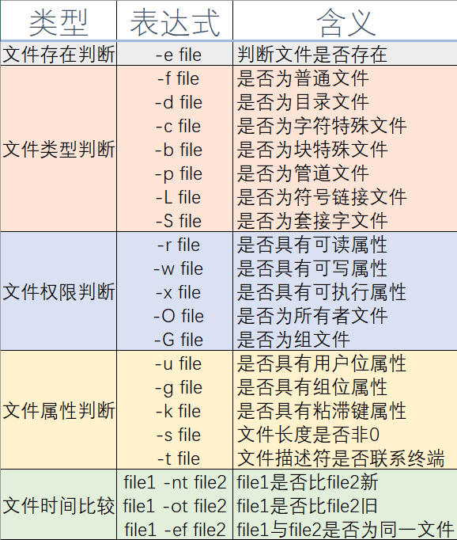
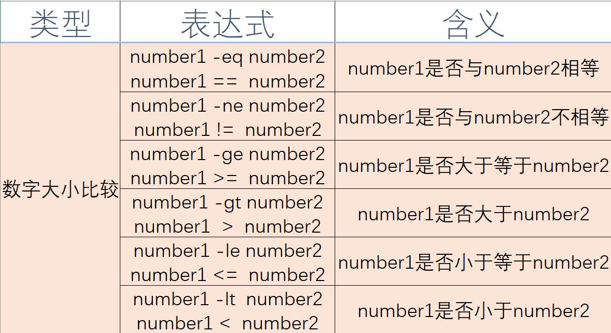
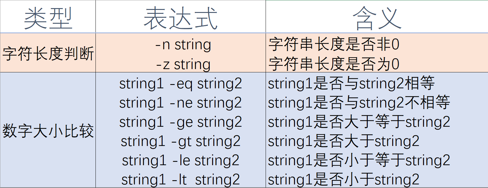

# 用户手册

## 环境配置

### 准备Linux类操作系统

* **Linux**用户：如果您使用的是Linux操作系统，那么您可以直接运行My Shell，理论上My Shell可以与任何版本的Linux操作系统兼容。如果您遇到了任何问题，欢迎及时与我们联系。
* **Windows**用户：如果您使用的是Windows操作系统，您可能需要通过安装WSL或者虚拟机才能支持My Shell的运行。WSL是由微软开发的适用于 Linux 的 Windows 子系统，目前支持Windows 10及以上版本的操作系统。关于WSL的使用可以参考官方的说明文档：https://docs.microsoft.com/zh-cn/windows/wsl/
* 其他操作系统用户：目前，My Shell仅支持在安装有glibc库的环境中编译运行，只有在Linux环境下才能支持全套指令。我们暂时还没有在Linux和Windows以外的操作系统中进行测试。如果您有任何好的想法或者意见可以与我们反馈。

### 添加环境变量（推荐）

如果您希望能够在系统中的任何地方方便的调用My Shell应用程序的话，那么我们非常建议您将My Shell程序所在目录添加到系统环境变量之中，这样可以使您使用My Shell更加方便。在Linux操作系统下，添加环境变量有如下几种方法：

1. **临时添加路径到目前的PATH**

   如果您只是想要临时修改环境变量体验一下的话，您可以采用这种方式添加环境变量。添加的方法为直接在命令行中输入 `PATH=<My Shell所在目录>:$PaTH` 即可。比如，如果您的My Shell程序是下载在/home/MyShell/ 目录下，那么您可以通过输入以下命令添加：

   ~~~bash
   PATH=/home/MyShell:$PATH
   ~~~

   需要注意的是，使用这种方法改变的环境变量只对当前会话有效。每当您登出或注销系统以后，PATH 设置就会失效。

2. **添加全局变量在/etc/profile文件中**
   使用管理员权限打开/etc/profile文件并在其中添加如下语句：

   ~~~bash
   export PATH="/home/MyShell:$PATH"
   ~~~

   这种方法可以使得该操作系统上所有用户的环境变量中都加入My Shell的环境变量，但需要您拥有管理员权限才可编辑。

3. **为当前用户永久修改PATH**
   打开当前用户主目录下的配置文件，比如在Ubuntu 22.04版本里的配置文件为~/.profile。修改其中的PATH行，将My Shell所在目录以类型的方式添加，便可以为当前用户永久修改环境路径。

## 基础知识

为了帮助您更好地理解shell中命令的一些行为，我们在这一节里为您准备了一些您理解接下来内容所需要的一些基础知识点的介绍。如果您觉得已经对这些内容有了比较好的理解的话，您可以直接跳过本节的内容进入下一节。在您阅读之后内容中如果有遇到任何技术上的问题也可以随时再回到本节重新复习一些与shell有关的基础知识点。

对于本节的内容，我们按照模块分为了几个小节，每一节的内容单独成段，自成一段独立的系统，互相之间几乎没有关联。您可以通过标题直接跳转到您感兴趣的部分开始阅读，这不会对您学习这些基础知识产生任何影响。当然，为了帮助您筑牢使用Linux操作系统中shell的基础知识，我们还是建议您按照小节的顺序逐一阅读。下面，就让我们一起开始了解shell中的这些基础知识吧。

### 重定向

所有的计算机命令可以归纳为“输入、处理、输出”三类操作的组合。在计算机软件运行程序时，默认的输入、输出都是从标准输入中输入，从标准输出中输出，即在用户所直接接触的终端上输入和显示输出。

但有时候，我们需要在不同的环境下进行命令的输入或者是程序执行结果的输出，这时候我们就需要将输入输出进行重定向，使得这些输入和输出可以在用户所需要的条件中完成。

在Linux操作系统中，所有的东西都是以文件的形式组织的，包括标准输入、标准输出、标准错误输出等也其实都是一个个文件。通常，标准输入指向的是用户键盘的输入，用户键盘的输入都已文件内容的形式在Linux程序中被共享；标准输出和标准错误输出练习的是显示屏幕，Linux程序都过向这些文件中输出就可以最终在用户的显示屏上显示相应的内容。

因此，要改变程序执行结果的输入和输出，实际上也就是改变这些输入和输出时所对应的文件描述符。当一个程序输入或者是输出的文件描述符被替换为其他文件的文件描述符时，该程序执行所需要的输入就会从输入文件描述符所对应的文件中获取，而该程序执行结果的输出也会打印到输出文件描述符所对应的文件之中。

将用户的输入和输出该表到不同的文件上执行的功能便称为重定向。

### 权限管理

在Linux操作系统中，权限系统一共被分为了三个层级——所有者、组以及所有人。每一个用户都属于某一个组。所有的文件都会在每一个层级上被设置相应的权限。而创建这个文件的用户就是该文件的所有者。

在每一个层级之中，文件又有三种访问权限，它们分别是读权限，写权限和执行权限。读权限允许用户列出该文件的内容或者目录的内容；写权限允许用户修改文本或者在目录下建立新文件，删除子目录和文件；执行权限允许用户运行该文件程序或者允许用户搜索这个目录。

因此，Linux的文件权限系统里对于每个文件一共就有三种用户，每种用户有三种访问权限。如果用1 bit表示每一种权限的话，那么3 bit就可以表示某一层级用户对该文件的权限，9 bit就能够将该文件的权限情况完全描述清楚了。 

掩码umask作为用户创建文件时帮助用户自动设置权限的工具，能够很好地为用户设置默认的文件管理权限。在用户创建文件时，系统会使用该文件的默认权限与用户掩码取反值相与，从而将用户不希望被设置的权限关闭。

例如，通常用户的默认掩码为0022（八进制），这表示在用户创建文件时该文件的组用户与所有用户的写权限与执行权限都会被关闭。这样，当用户创建一个文本文件时，该文件的默认权限便为 0666 & （~0022） = 110 110 110 & 111 101 101 = 110 100 100 = rw- r-- r-- ；即用户拥有读写权限，而其他用户只有读权限。当用户创建可执行文件或是目录时，默认权限为 0777 & (~0022) = 111 111 111 & 111 101 101 = 111 101 101 = rwx r-x r-x；即用户拥有所有权限，而其他用户只有读权限与执行权限。

### 管道通信

管道时指用于连接一个读进程和一个写进程，以实现它们之间通信的共享文件。管道通信的实现是以文件系统为基础的。当一个写进程向管道的共享文件中输入数据时，接收管道输出的读进程就能够通过该共享文件从管道中接收到从写进程发送来的数据。

多个进程之间可以互相进行管道通信，两个需要共享的命令之间使用管道符“|”分隔。例如，下面这个程序就是利用管道通信实现当前目录下文件及子目录数量统计功能的一条命令：

~~~shell
ls | wc -l
~~~

其形象化的显示如下图，整个通信就如同在一根管道间进行一般：

## 内部命令

### bg

bg命令的格式为：bg <job>

bg命令用于将被挂起的进程<job>转到后台。如果没有<job>参数，则默认将当前进程放到后台运行，相当于在命令后加上&符号。

### cd

cd命令的格式为：cd <directory>  

该命令可以把当前默认目录改变为<directory>。如果没有<directory>参数，则显示主目录。如该目录不存在，会出现相应的错误信息。其中，用户的主目录可以使用**“\~”符号**替代。

同时，这个命令也会改变PWD环境变量，让用户的PWD环境变量与当前工作目录保持一致。

### clr

clr  是一个清屏命令。clr命令等价与普通shell中的clear命令，其作用是将显示屏幕上的内容全部清除干净。

### dir

dir命令的命令格式为：dir <directory>  

该命令的功能是列出目录<directory>的内容。如果没有<directory>参数，则显示当前目录内容。在实现上，dir命令与cd命令有许多异曲同工之处，二者都是对目录进行操作。

与cd命令类似，dir命令也会将“\~”字符替换为用户的主目录。

### echo

echo命令的格式为：echo <comment> 

echo命令用于在屏幕上显示<comment>并换行，其中多个空格和制表符被缩减为一个空格。

### exec

exec命令的命令格式为：exec <command> 

exec命令用于执行命令<command>，并且将该命令对应的代码覆盖当前运行这个命令的进程的代码，以执行新的命令替换 当前的shell进程。

### exit

exit命令可以退出当前shell。

### fg

fg命令的命令格式为：fg <job>

fg命令用于将后台运行或挂起的作业<job>切换到前台运行。如果该作业原本在后台运行，则其运行将变为前台；如果该作业原本在后台暂定了，则会先启动该进程再放至前台运行。

### help

help 命令可以显示用户手册。

在程序所在的doc目录下存放了供用户阅读的用户手册，当用户输入help命令后，程序会读取doc目录下的用户手册并将其显示在屏幕上。使用more 命令可以过滤用户手册的信息。

同时，在`doxygen`工具的帮助下我们也生成相应的man指南，用户可以使用其提供帮助。

### jobs

jobs <job> ——显示所有挂起的和后台进程的作业号及状态。如果没有列表，则显示当前进程的状态。

在用户通过&操作符或者Ctrl Z控制信号引起一个子进程被挂起到后台时的进程相关信息可以通过调用job命令查找。shell会快速打印出所有进程的信息或是查找到某一进程的状态信息。

### pwd

pwd 命令的功能是显示当前目录。

### set

set命令用于列出系统中所有的环境变量。

### test

test命令的命令格式为：test <expression> 

test命令可以检测用户输入的表达式<expression>返回的结果是true还是false。为了使命令测试的结果更加可视化，如果test命令返回的结果是正确的且输出在终端中，那么终端上将显示“true”；如果test命令返回的结果是错误的且输出在终端中，那么终端上将显示“false”。

test命令支持丰富的命令格式，根据用户输入的参数不同，test命令可以完成文件测试、整数测试或者是字符串测试。目前test命令中支持的各类测试参数及其含义如下。

1. 文件测试

   

   

2. 整数测试

   

   

3. 字符串测试

   

### time

time 命令用于显示当前时间。需要注意的是，这里的time命令并不是指Linux当中用于计时的time命令，而是date命令——显示当前的日期与时间等相关信息。

### umask

umask <mask> ——设定新创建文件或目录的访问特权。如果没有<mask>参数，则显示当前设置的掩码。

<mask>是位的掩码，通常用八进制表示。掩码位为1表示新创建的文件相应的访问特权应该被关闭。在输入时，用户可以以任意进制的方式输入，只是需要在以除了十进制之外的进制输入时需要加上对应进制表示的前缀。例如在输入八进制数前应该加上字符‘0’，在输入十六进制数前应该加上字符‘0x’。

## 批处理文件执行

除了直接从终端的命令行中读入用户一条条命令的输入之外，shell也支持从文件中提取命令行输入。在shell中输入myshell加上所要执行的批处理文件名便可以从这些文件中读入命令行输入。

例如，用户可以在shell中使用以下命令行调用批处理：

~~~shell
$ myshell batchfile 
~~~

在这个命令中，batchfile是我们要执行的一个批处理文件，这个批处理文件可以包含一组命令集。调用此命令后shell会依次执行该命令集中的每条命令，当到达文件结尾时shell 退出返回到直接调用myshell时的状态。

如果shell 被调用时没有使用参数，则会在屏幕上显示提示符'> '请求用户输入批处理文件。

shell支持**同时处理多个批处理文件**，这些批处理文件会按照输入的顺序逐一解析执行。

## I/O 重定向

为了适应用户在不同环境中输入与输出的需求，shell 支持stdin 和stdout 的I/O 重定向。

例如命令行为：

~~~shell
programname arg1 arg2 < inputfile > outputfile 
~~~

表示使用arg1 和arg2 执行程序programname，输入文件流被替换为inputfile，输出文件流被替换为outputfile。
使用输出重定向时，如果重定向字符是>，则创建输出文件，如果存在则覆盖之；如果重定向字符为>>，也会创建输出文件，如果存在则添加到文件尾。

同时，输入输出重定向也支持加入重定向的文件描述符的标识，例如，标准输入重定向可以写为 0< ；标准输出重定向可以写为 1> 等。

## 后台程序执行

 shell 能够支持后台程序执行。如果在一条命令行的末尾添加了&字符，那么该命令将在后台运行，而前台可以继续执行其他程序。当后台程序运行完成之后会将结果显示在前台并给予任务完成的信息提示。

## 管道操作

shell命令行支持管道（“|”）操作，可以将上一条命令执行的结果作为下一条命令的输入传递。多个进程之间可以互相进行管道通信，两个需要共享的命令之间使用管道符“|”分隔。

## 联系我们

本项目由浙江大学学生邱日宏独立开发完成。如果您在使用过程中遇到了任何问题，或是对我们的项目有任何好的建议，您可以通过邮箱3200105842@zju.edu.cn与我们联系，非常感谢您对项目的支持与建议！

## 附录

### MyShell内部指令列表

1)	bg <job> ——将被挂起的作业<job>转到后台。如果没有<job>参数，则默认将当前进程放到后台运行。

2)	cd <directory>  ——把当前默认目录改变为<directory>。如果没有<directory>参数，则显示主目录。

3)	clr  ——清屏。

4)	dir <directory>  ——列出目录<directory>的内容。如果没有<directory>参数，则显示当前目录内容。

5)	echo <comment>  ——在屏幕上显示<comment>并换行，多个空格和制表符将被缩减为一个空格。

6)	exec <command> ——执行命令<command>替换当前运行这个命令的进程。

7)	exit  ——退出shell。

8)	fg <job> ——将后台运行或挂起的作业<job>切换到前台运行。如果没有<job>参数，则默认将当前进程放到后台运行。

9)	help ——显示用户手册，即本文档。

10)	jobs <job> ——显示所有挂起的和后台进程的作业号及状态。如果没有列表，则显示当前进程的状态。

11)	pwd ——显示当前目录。

12)	set  ——列出所有的环境变量。

13)	test <expression> ——检测表达式<expression>返回true还是false。

14)	time ——显示当前时间。

15)	umask <mask> ——设定新创建文件或目录的访问特权。如果没有<mask>参数，则显示当前设置的掩码。
